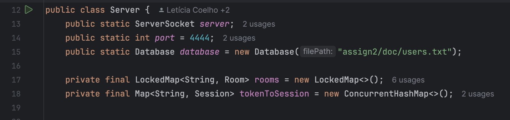
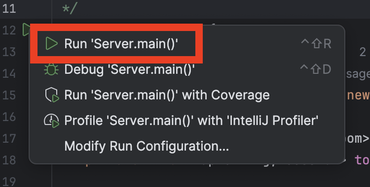
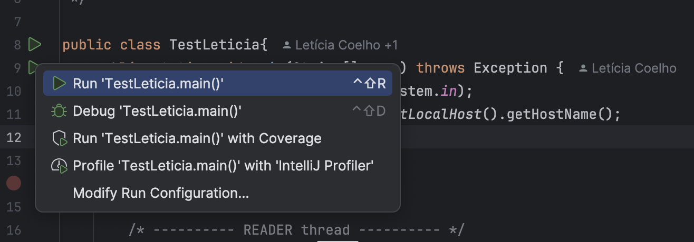

# Project 2 - Distributed Systems Assignment

This project implements a multi-room, token-authenticated client-server chat system using Java and TCP sockets. It supports regular and AI-powered chat rooms, persistent sessions using tokens, and fault tolerance on reconnect.

## Run the Server
If using IntelliJ, to start the Server you need to go to ChatApp/src folder and open Server.java file.

## Run a Client
Use TestLeticia.java, TestVictor.java, or TestBia.java to simulate one or multiple clients.

## Using the App
On first run: \
**Choose 2** - Register \
Provide a username and password.

On future runs: \
**Choose 1** - Login \
You'll receive a session token. If the connection drops, this token will resume your session when the client reconnects.

**Chatting**
- Enter the name of a room to join or create it
- Type messages to chat
- Type **/leave** to return to the lobby
- Type **/quit** to exit the application